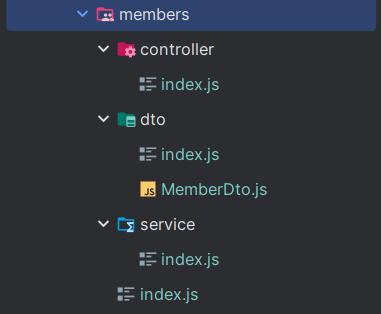
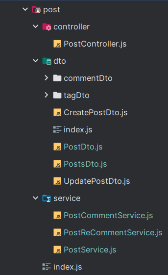
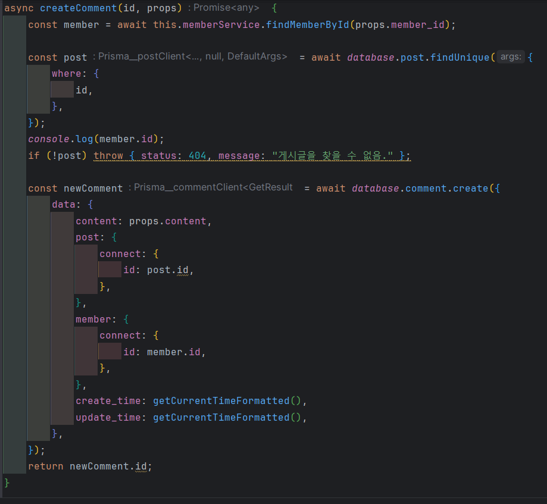
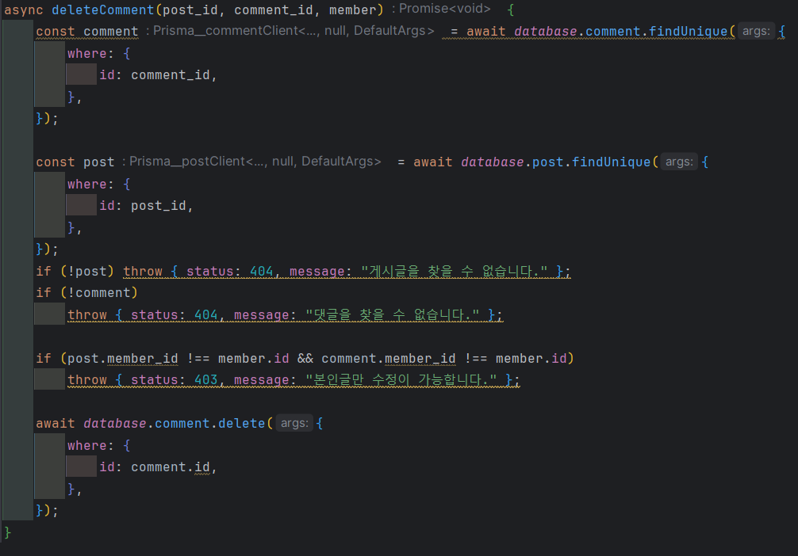

## 12월4주차

### Backend Node.js express 회고

### 첫 번째 느낀점

node를 공부할 때 File명과 File 내에 있는 class명이 달라서 왜 굳이? 라는 생각이 들었다.

이전의 프로젝트들은 Java와 Spring을 사용해서 프로젝트를 진행했었는데 그때는 Class명과 File의 명이 같았기 때문이다.

그렇게 했을 때 내가 생각하는 장점
 

1. 가독성이 좋다.
    
2. 파일명만 보고도 Class명을 알 수 있고, 대략적으로 어떤 기능을 하는지가 그려진다.
 
  

  이러한 장점으로 인해 처음에는 강의를 따라서 개발하다가, 파일명과 Class명을 일치시켜서 진행했다. 
  

  아래 그림1과 그림2는 처음과 node로 개발을 열심히 진행할 때다.
  

 
그림 1

 
그림 2

### 두 번째 느낀점

그림 2는 각 DB에 있는 Table마다 Service를 여러개 뒀다.

이렇게 했을 때의 장점
 

1. 가독성이 좋다. 이 말은 하나의 서비스에 너무 길게 작성하면 원하는 메서드를 바로 찾기 어렵고, 개발하는 사람도 헷갈린다.
    
2. 두 번째 장점 역시 위의 장점과 마찬가지이다. 대략적으로 어떤 기능들이 담겨 있겠다는 것을 알 수 있기 때문이다.

이러한 장점으로 하나의 파일에 코드가 너무 길다면, 비슷한 기능들끼리 묶어 새로운 파일로 작성하는 것이 좋다고 생각한다.

### 세 번째 느낀점

JavaScript의 특성상, 정확한 변수를 정의하기 보다는 `props`를 많이 사용하는 모습을 볼 수 있다. 하지만 props는 개인이 개발할 때는 어떤 변수가 들어와서 로직이 진행이 되는 것을 알 수 있겠지만, 여러명이서 하는 개발에서는 props로 남겨두면 이해하는데 좀 더 많은 시간이 걸릴 것이라고 판단했다.

그렇게 해서 나는 원하는 request 변수를 DTO로 감싸거나, 직접 모두 작성하였다.

아래의 그림 3 개발 초기 당시, 배운 것을 그대로 사용했을 때였다. 그러다 명확하게 요구하는 값들을 작성하여서 보다 다른 사람이 이해하기 쉽게 작성하였다.

 
그림3

 
그림4

